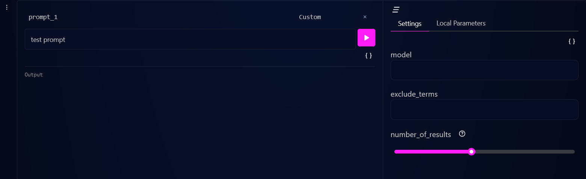

# Adding Custom Cells to the AI config library

The custom cell that was developed:
The cell has a mock API as a model, and has settings similar to google-search API



## Steps to run:

1. Clone the git repository
2. To run the client move to `python/src/aiconfig/editor/client` and run the following command. The client now runs at http://localhost:3000/ .

```shell
yarn start
```

3. To run the server, move to `custom-parser` and run the following command. Now another client opens at http://localhost:8080/ but that is not needed as the custom client is running at PORT 3000.

```shell
 pip install python-aiconfig
 aiconfig edit --aiconfig-path=target.aiconfig.json
```

4. To register the custom parser to the model parser registry, use a REST API client (Postman) and execute a POST request to http://localhost:8080/api/load_model_parser_module with the following request body.

```JSON
{
  path: '<full path to custom-parser/aiconfig_model_registry.py>'
}
```

5. To run the FastAPI endpoint that sends out dummy data, run the folowing command in the `custom-parsers` folder.

```shell
uvicorn main:app --reload
```
